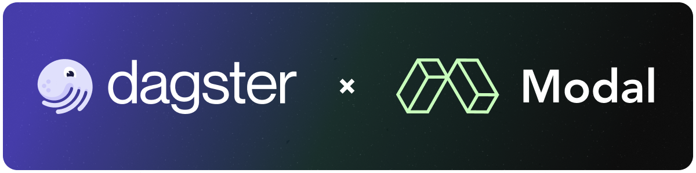

# Dagster × Modal Demo



Orchestrate your flexible compute workloads with the combined forces of Dagster and Modal.

In this example project we show how you can write a pipeline that automatically detects newly
published podcasts, transcribes them using the power of GPUs, and notifies you with the summary so
that you can focus on the things that truly matter (not listening to people talk into fancy
microphones).

## Getting started

Install the project dependencies:

```sh
pip install -e ".[dev]"
```

Run Dagster:

```sh
dagster dev
```

Open http://localhost:3000 in your browser.

## Demonstration

- Leveraging Modal's compute from Dagster
- Accessing Dagster `context` from Modal (e.g., Dagster partitions)

Real world example:

- Get audio files for top podcasts
- Upload audio files to Modal storage
- Transcribe audio using Modal and upload full descriptions
- Summarize transcriptions in Modal storage
- Write summaries to Modal storage


## Podcast Feeds

Podcasts are sourced from RSS feeds as; a table containing a sample of feeds is below:

| Title                                             | RSS Feed                                                          |
|---------------------------------------------------|-------------------------------------------------------------------|
| Practical AI: Machine Learning, Data Science, LLM | [RSS Feed](https://changelog.com/practicalai/feed)                |
| The Data Exchange with Ben Lorica                 | [RSS Feed](https://feeds.buzzsprout.com/682433.rss)               |
| Hub & Spoken: Data                                | [RSS Feed](https://cynozure.libsyn.com/rss)                       |
| Making Data Simple                                | [RSS Feed](http://feeds.feedburner.com/IBM-big-data-hub-podcasts) |
| The Data Chief                                    | [RSS Feed](https://feeds.simplecast.com/75zUZHD_)                 |

<details>
<summary>Example RSS feed response for the Changelog podcast</summary>

```xml
<?xml version="1.0" encoding="UTF-8"?>
<rss version="2.0" xmlns:atom="http://www.w3.org/2005/Atom" xmlns:content="http://purl.org/rss/1.0/modules/content/" xmlns:itunes="http://www.itunes.com/dtds/podcast-1.0.dtd" xmlns:podcast="https://podcastindex.org/namespace/1.0" xmlns:psc="http://podlove.org/simple-chapters">
  <channel>
    <title>Practical AI: Machine Learning, Data Science, LLM</title>
    <copyright>All rights reserved</copyright>
    <link>https://changelog.com/practicalai</link>
    <atom:link type="application/rss+xml" rel="self" href="https://changelog.com/practicalai/feed"/>
    <atom:link type="text/html" rel="alternate" href="https://changelog.com/practicalai"/>
    <language>en-us</language>
    <description>Making artificial intelligence practical, productive &amp; accessible to everyone. Practical AI is a show in which technology professionals, business people, students, enthusiasts, and expert guests engage in lively discussions about Artificial Intelligence and related topics (Machine Learning, Deep Learning, Neural Networks, GANs, MLOps, AIOps, LLMs &amp; more).

The focus is on productive implementations and real-world scenarios that are accessible to everyone. If you want to keep up with the latest advances in AI, while keeping one foot in the real world, then this is the show for you!</description>
    <itunes:summary>Making artificial intelligence practical, productive &amp; accessible to everyone. Practical AI is a show in which technology professionals, business people, students, enthusiasts, and expert guests engage in lively discussions about Artificial Intelligence and related topics (Machine Learning, Deep Learning, Neural Networks, GANs, MLOps, AIOps, LLMs &amp; more).

The focus is on productive implementations and real-world scenarios that are accessible to everyone. If you want to keep up with the latest advances in AI, while keeping one foot in the real world, then this is the show for you!</itunes:summary>
    <itunes:explicit>no</itunes:explicit>
    <itunes:image href="https://cdn.changelog.com/uploads/covers/practical-ai-original.png?v=63725770374"/>
    <itunes:author>Changelog Media</itunes:author>
    <itunes:owner>
      <itunes:name>Changelog Media</itunes:name>
      <itunes:email>editors@changelog.com</itunes:email>
    </itunes:owner>
    <itunes:keywords>changelog, ai, machine learning, deep learning, artificial intelligence, neural networks, computer vision</itunes:keywords>
    <itunes:category>
      <itunes:category text="Software How-To"/>
      <itunes:category text="Tech News"/>
    </itunes:category>
    <podcast:funding url="https://changelog.com/++">Support our work by joining Changelog++</podcast:funding>
    <podcast:person role="host" href="https://changelog.com/person/chris" img="https://cdn.changelog.com/uploads/avatars/people/j8b/avatar_large.png?v=63706916892">Chris Benson</podcast:person>
    <podcast:person role="host" href="https://changelog.com/person/dwhitena" img="https://secure.gravatar.com/avatar/1ea0c31fbcab54853329d9f7bcdb6d6d.jpg?s=600&amp;d=mm">Daniel Whitenack</podcast:person>
    <item>
      <title>AI is more than GenAI</title>
      <guid isPermaLink="false">changelog.com/7/2551</guid>
      <link>https://changelog.com/practicalai/285</link>
      <pubDate>Thu, 05 Sep 2024 14:00:00 +0000</pubDate>
      <enclosure type="audio/mpeg" length="38682656" url="https://op3.dev/e/https://cdn.changelog.com/uploads/practicalai/285/practical-ai-285.mp3"/>
      <description>GenAI is often what people think of when someone mentions AI. However, AI is much more. In this episode, Daniel breaks down a history of developments in data science, machine learning, AI, and GenAI in this episode to give listeners a better mental model. Don&apos;t miss this one if you are wanting to understand the AI ecosystem holistically and how models, embeddings, data, prompts, etc. all fit together.</description>
      <itunes:episodeType>full</itunes:episodeType>
      <itunes:image href="https://cdn.changelog.com/uploads/covers/practical-ai-original.png?v=63725770374"/>
      <itunes:duration>40:05</itunes:duration>
      <itunes:explicit>no</itunes:explicit>
      <podcast:person role="host" href="https://changelog.com/person/dwhitena" img="https://secure.gravatar.com/avatar/1ea0c31fbcab54853329d9f7bcdb6d6d.jpg?s=600&amp;d=mm">Daniel Whitenack</podcast:person>

      <podcast:chapters type="application/json+chapters" url="https://changelog.com/practicalai/285/chapters"/>
      <psc:chapters version="1.1" xmlns="http://podlove.org/simple-chapters">
        <psc:chapter start="0" title="Welcome to Practical AI"/>
        <psc:chapter start="48" title="Sponsor: Speakeasy" href="https://speakeasy.com/"/>
        <psc:chapter start="107" title="Show rundown"/>
        <psc:chapter start="164" title="AI ≠ Generative AI"/>
        <psc:chapter start="214" title="Tour of AI ML history"/>
        <psc:chapter start="285" title="1st phase of ML"/>
        <psc:chapter start="372" title="Parameterized software functions"/>
        <psc:chapter start="583" title="Forming the model"/>
        <psc:chapter start="779" title="Foundation models"/>
        <psc:chapter start="1163" title="1st aside"/>
        <psc:chapter start="1369" title="2nd aside"/>
        <psc:chapter start="1516" title="Most recent phase"/>
        <psc:chapter start="1731" title="Current state of AI"/>
        <psc:chapter start="1926" title="Still efficient"/>
        <psc:chapter start="2026" title="Role specific models"/>
        <psc:chapter start="2101" title="Combination of models"/>
        <psc:chapter start="2166" title="It's not fairy dust"/>
        <psc:chapter start="2239" title="Wrapping up"/>
        <psc:chapter start="2357" title="Outro"/>
      </psc:chapters>
      <content:encoded><![CDATA[<p>GenAI is often what people think of when someone mentions AI. However, AI is much more. In this episode, Daniel breaks down a history of developments in data science, machine learning, AI, and GenAI in this episode to give listeners a better mental model. Don’t miss this one if you are wanting to understand the AI ecosystem holistically and how models, embeddings, data, prompts, etc. all fit together.</p>
<p><a href="https://changelog.com/practicalai/285/discuss">Leave us a comment</a></p><p><a href="https://changelog.com/++" rel="payment">Changelog++</a> members save 2 minutes on this episode because they made the ads disappear. Join today!</p><p>Sponsors:</p><p><ul><li><a href="https://speakeasy.com/">Speakeasy</a> – <strong>Production-ready, enterprise-resilient, best-in-class SDKs</strong> crafted in minutes. Speakeasy takes care of the entire SDK workflow to save you significant time, delivering SDKs to your customers in minutes with just a few clicks! <a href="https://speakeasy.com/">Create your first SDK for free!</a>
</li>
</ul></p><p>Featuring:</p><ul><li>Daniel Whitenack &ndash; <a href="https://twitter.com/dwhitena" rel="external ugc">Twitter</a>, <a href="https://github.com/dwhitena" rel="external ugc">GitHub</a>, <a href="https://www.datadan.io/" rel="external ugc">Website</a></li></ul></p><p>Show Notes:</p><p><ul>
<li><a href="https://scikit-learn.org/stable/">scikit-learn</a></li>
<li><a href="https://cloud.google.com/automl?hl=en">AutoML in Google Cloud</a></li>
</ul>
</p><p>Something missing or broken? <a href="https://github.com/thechangelog/show-notes/blob/master/practicalai/practical-ai-285.md">PRs welcome!</a></p>]]></content:encoded>
    </item>
  </channel>
</rss>
```
</details>
